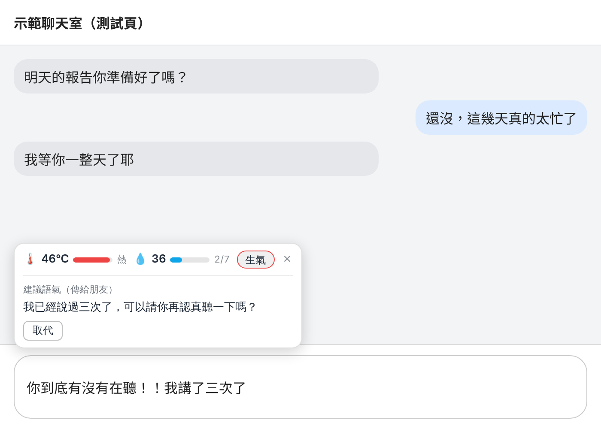
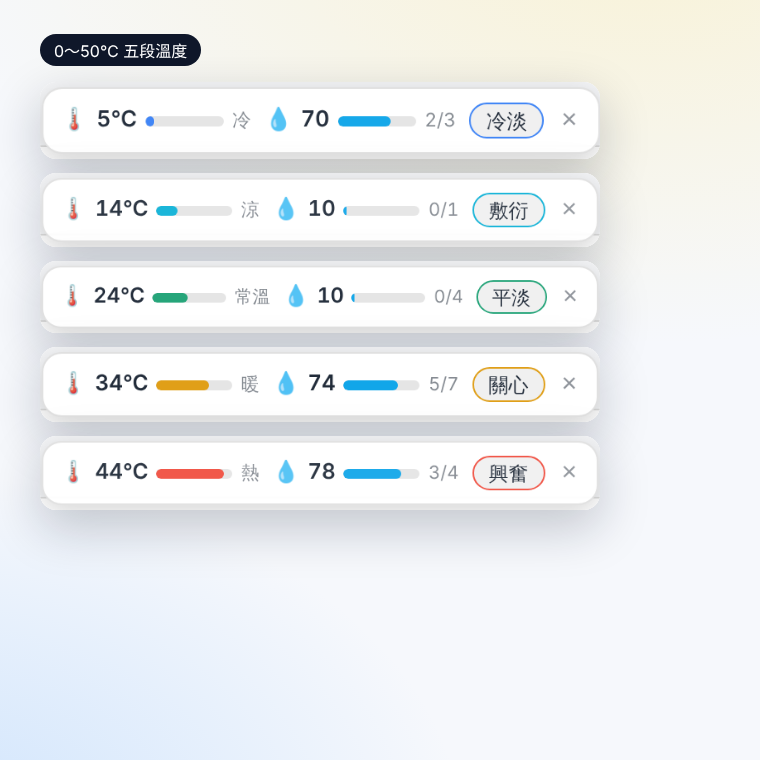
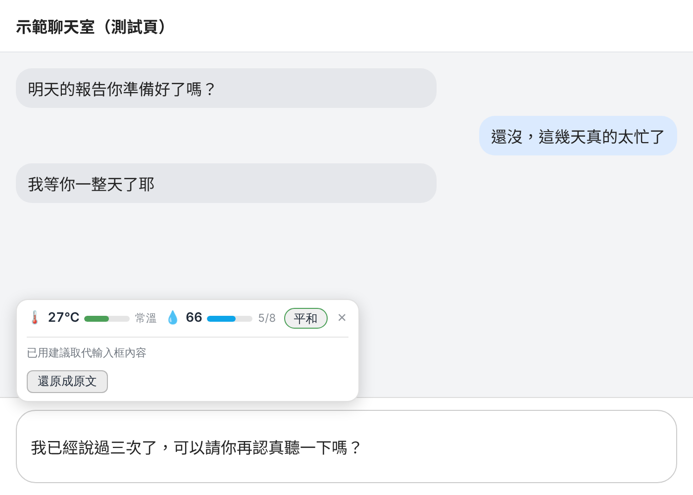
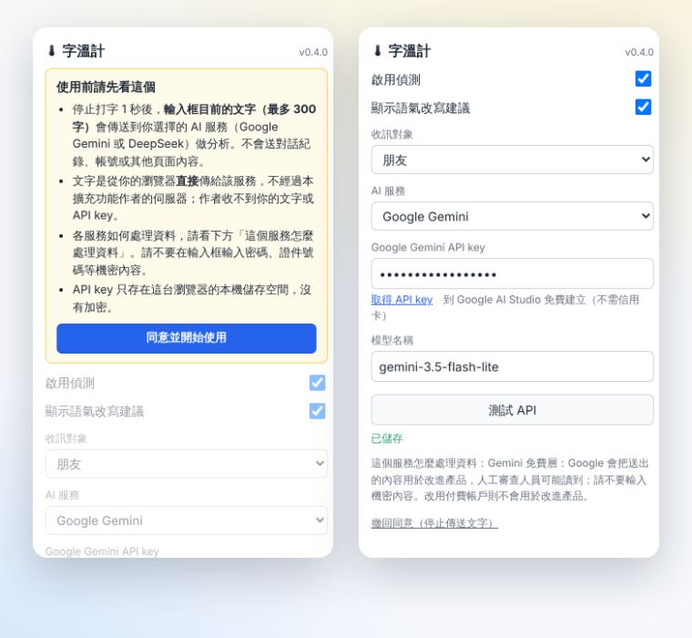

# 🌡 字溫計 TextThermo

在聊天室輸入框打字，**停下來 1 秒後**，替這則還沒送出的訊息量「**溫度**」（語氣是冷是熱）與「**濕度**」（是客觀陳述，還是帶著很多互動與情感），並且依收訊對象（同事、親人、朋友、對象、前輩、後輩）給出**改寫建議**，一鍵取代。

[English](README.en.md) · [更新紀錄](CHANGELOG.md) · [隱私權政策](docs/PRIVACY.md) · [參與貢獻](CONTRIBUTING.md)



> 示範頁是測試用的假聊天室，AI 回應為預先準備的示範資料。

## 它做什麼

| | 說明 |
| --- | --- |
| **溫度 0–50℃** | 語氣的熱度。0–9 冷（厭惡、冷淡、難過）、10–19 涼（敷衍、疏離）、20–29 常溫（平和、親切、開心）、30–39 暖（熱情、關愛）、40–50 熱（生氣、激動、非常興奮）。顏色由藍漸變到紅。 |
| **濕度 10–100** | 互動詞／情感詞占整句的比例：`濕度 = 10 + 90 × 互動／情感詞數 ÷ 總詞數`。「我愛你」三個詞都是互動詞 → 100；夾雜較多客觀內容的句子會比較低。長短不是重點，**占比**才是。 |
| **情緒標籤** | 獨立的一小塊（例如「關心」「生氣」），用來區分同樣偏熱的生氣與興奮。 |
| **改寫建議** | 依你選的收訊對象，把這句話改成更適合對方的語氣；按「取代」直接換掉輸入框的文字，也可以「還原成原文」。 |



按「取代」之後，輸入框變成建議內容、浮動框重新分析新文字，並出現「還原成原文」：



特色：

- **自備 API key，沒有中間伺服器**：文字直接從你的瀏覽器傳到你選的 AI 服務（Google Gemini 或 DeepSeek），作者收不到。
- **同意之後才會送出任何文字**，並且可以隨時撤回。
- 輸入注音／拼音選字時不會誤觸發；按 Enter 送出訊息後浮動框會自動消失。
- 只處理聊天輸入框（`textarea`、`contenteditable`），不會處理一般的搜尋框、密碼框。

## 支援的網站

| 網站 | 狀態 |
| --- | --- |
| Instagram 網頁版私訊（`www.instagram.com`） | ✅ 作者實際使用 |
| Messenger（`www.messenger.com`） | 🟡 輸入框同為 Lexical 編輯器，已用真實 Lexical 編輯器測過；尚未在真實網站驗證 |
| Discord（`discord.com`）、Telegram Web（`web.telegram.org`） | 🧪 實驗性：理論上可用，未實測 |

要新增網站，見下方〈開發〉。

## 安裝

需要電腦版 Chrome（或其他 Chromium 瀏覽器，如 Edge、Brave）。

**方法 A：下載 Release（最簡單）**

1. 到本專案的 [Releases](../../releases) 頁面，下載最新的 `text-thermo-vX.Y.Z.zip` 並解壓縮。
2. 網址列輸入 `chrome://extensions`，開啟右上角「開發人員模式」。
3. 按「載入未封裝項目」，選擇解壓縮出來的資料夾（裡面直接有 `manifest.json`）。

**方法 B：從原始碼**

```bash
git clone https://github.com/yusinchenn/text-thermo.git
```

然後同樣在 `chrome://extensions` 按「載入未封裝項目」，選擇 repo 裡的 **`extension/`** 資料夾。

> 之後更新：覆蓋舊的檔案 → 在 `chrome://extensions` 按擴充功能的「重新載入」→ **把已開著的聊天分頁重新整理（F5）**。

## 開始使用

1. 點瀏覽器右上角的字溫計圖示（可能收在拼圖形狀的擴充功能選單裡，可以按圖釘固定）。
2. 閱讀「使用前請先看這個」，按 **同意並開始使用**。
3. 選擇 **AI 服務**並貼上 API key（取得方式見下節），按 **測試 API**，看到 ✅ 就完成了。
4. 選擇預設的 **收訊對象**。
5. 到聊天室打字，停 1 秒，浮動框就會出現在輸入框上方。至少要 2 個字才會分析；最多取最後 300 字。



### 取得 API key

| 服務 | 費用 | 取得方式 |
| --- | --- | --- |
| **Google Gemini**（預設） | 有免費層，**免信用卡** | 到 [Google AI Studio](https://aistudio.google.com/apikey) 建立 API key |
| **DeepSeek** | 依用量計費，需儲值（個人使用通常很便宜） | 到 [DeepSeek 開放平台](https://platform.deepseek.com/api_keys) 建立並儲值 |

兩者各有取捨：

- **Gemini 免費層**：不用付錢，但有每分鐘／每日的請求上限（實際數字依模型與帳號而定，請在 AI Studio 的額度頁面查看）；擴充功能每次「停止打字」就可能呼叫一次，額度用完會顯示「已達免費額度上限」，這時可以換模型或改用 DeepSeek。Google 的條款寫明，**免費層的內容會被用於改進 Google 的產品，人工審查人員可能讀到**；不要在輸入框輸入機密內容。Gemini API 的條款要求使用者年滿 18 歲；另外，條款對歐盟／英國／瑞士的使用者有額外規定（向這些地區的使用者提供 API 用戶端時須使用付費服務），身在這些地區請先自行確認適用的條款。
- **DeepSeek**：資料儲存在中華人民共和國境內的伺服器；其隱私政策提到可選擇退出模型訓練，但沒有明確說明 API 內容是否預設用於訓練。

模型名稱可以在設定面板修改（預設 Gemini 為 `gemini-3.5-flash-lite`、DeepSeek 為 `deepseek-flash`）。服務商常會更換或下架舊模型，如果出現「找不到這個模型」，請到該服務的文件查最新名稱。**建議使用 flash-lite 這類不做長時間思考的小模型**，速度快、省額度。

## 疑難排解

| 狀況 | 怎麼辦 |
| --- | --- |
| 打字後沒有任何浮動框 | 先到 `chrome://extensions` 確認已啟用；再把聊天分頁**重新整理**（擴充功能重新載入前就開著的分頁不會載入新程式）；按 F12 開 Console 篩選「字溫計」，可以看到「content script 已載入」「已鎖定輸入框」「分析中…」「完成／失敗」，哪一行沒出現就是卡在那一步。 |
| 浮動框顯示「請先…同意並開始使用／填入 API key」 | 到設定面板完成同意與填入 key。這個提示每次設定變動後只會出現一次。 |
| 「擴充功能剛更新過」／`Extension context invalidated` | 這個分頁是在擴充功能重新載入前開的，按浮動框的「重新整理頁面」或 F5。 |
| 「已達 Gemini 的免費額度上限」（429） | 稍後再試，或換模型、改用 DeepSeek。 |
| 「API key 無效」 | 重新貼上 key；注意前後不要有多餘字元。 |
| 「找不到這個模型」 | 模型名稱過期，到服務商文件查最新名稱，或清空欄位使用預設值。 |
| 「Gemini 免費層在你所在的地區不可用」 | 需要在 Google AI Studio 啟用帳單，或改用 DeepSeek。 |
| 「因安全設定拒絕分析這段文字」 | Gemini 擋下了這段內容（例如很激烈的字眼），可改用 DeepSeek。 |
| `chrome://extensions` 上 Service Worker 顯示「無法使用」 | 這是正常的休眠狀態，有請求時會自動喚醒；按「測試 API」成功就代表它運作正常。 |
| 「取代」沒有反應，浮動框說「已複製，請手動貼上」 | 這個輸入框不接受程式寫入，建議內容已放進剪貼簿，自己貼上即可。歡迎開 issue 並附上網站名稱。 |

## 資料與隱私

- 只會送出：**輸入框目前的文字（最多 300 字）**、收訊對象類別、改寫開關，到**你選擇的那一個** AI 服務。不送對話紀錄、帳號、網址或其他頁面內容。
- 沒有作者的伺服器、沒有統計、沒有追蹤。API key 與設定存在瀏覽器的 `chrome.storage.local`（本機、未加密，**不會**跨裝置同步）。
- 回應快取只放在記憶體，瀏覽器關閉或擴充功能休眠後就清除。
- 完整說明見 [隱私權政策](docs/PRIVACY.md)。

## 開發

```text
extension/        擴充功能本體（載入未封裝項目時選這個資料夾）
  manifest.json     MV3 設定；content_scripts.matches 決定在哪些網站啟用
  shared.js         對象清單、服務清單、預設設定、錯誤說明（content／background／popup 共用）
  background.js     service worker：組提示詞、呼叫 Gemini／DeepSeek、計算濕度、快取
  content.js        監聽輸入框、1 秒 debounce、浮動框（Shadow DOM）、取代／還原
  popup.html/js     設定面板（同意、服務、key、模型、測試 API）
tests/            單元測試（vm／jsdom）與真實瀏覽器端對端測試
scripts/          產生圖示、商店圖片、打包 zip
docs/             隱私權政策、上架指南、商店文案
store/            Chrome 線上應用程式商店用圖片
```

```bash
npm install            # 需要 Node.js 20.19+ / 22.13+ / 24+
npm test               # 單元測試（不需要瀏覽器）
npm run test:e2e       # 端對端：需要 Chromium，見下
npm run package        # 產生 dist/text-thermo-vX.Y.Z.zip（只含 extension/ 的內容）
```

端對端測試會把 `extension/` 真的載入 Chromium、走完「同意 → 填 key → 打字 → 分析 → 取代 → 還原」，只有 AI 服務的網路回應是假的。需要有 Chromium：`npx playwright-core install chromium`，或用環境變數指定現成的瀏覽器：`CHROME_PATH=/path/to/chrome npm run test:e2e`。

**常改的地方**

- 去抖時間、最短／最長字數：`content.js` 最上方的 `DEBOUNCE_MS`、`MIN_CHARS`、`MAX_CHARS`
- 溫度五段的定義與錨點句、哪些詞算互動／情感詞：`background.js` 的 `BASE_PROMPT`；顏色與區間名稱：`content.js` 的 `tempBand`、`TEMP_STOPS`
- 濕度公式：`background.js` 的 `humidityFromWords`
- 新增對象類型：`shared.js` 的 `TARGETS`
- **新增網站**：在 `manifest.json` 的 `content_scripts[0].matches` 加入網址，重新載入擴充功能；若該網站的輸入框不接受「取代」，看 `content.js` 的 `replaceText`
- **新增 AI 服務**：在 `shared.js` 的 `PROVIDERS` 加設定、`background.js` 寫一個 `callXxx` 並登錄到 `CALLERS`，並把網域加到 `manifest.json` 的 `host_permissions`（記得同步更新隱私權政策）

更多細節見 [CONTRIBUTING.md](CONTRIBUTING.md)。想把它上架到 Chrome 線上應用程式商店，見 [docs/PUBLISHING.md](docs/PUBLISHING.md)。

## 已知限制

- 溫度與濕度是**大型語言模型的主觀判斷**（濕度的比例由程式算，但「哪些詞算互動詞」仍由模型標記），不是科學量測，同一句話換模型可能略有差異。
- 反諷、方言、只有雙方才懂的梗，模型可能判斷錯誤。
- 網站改版可能讓輸入框偵測或「取代」失效；請開 issue。
- 目前介面只有繁體中文。

## 授權與聲明

[MIT License](LICENSE)。

本專案為獨立的個人作品，與 Instagram、Meta、Discord、Telegram、Google、DeepSeek 皆無隸屬、贊助或背書關係；所有商標屬於各自的擁有者。
